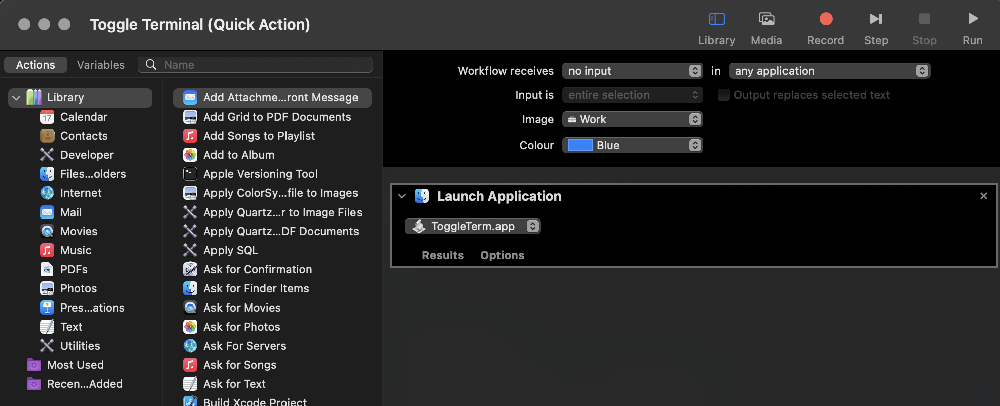
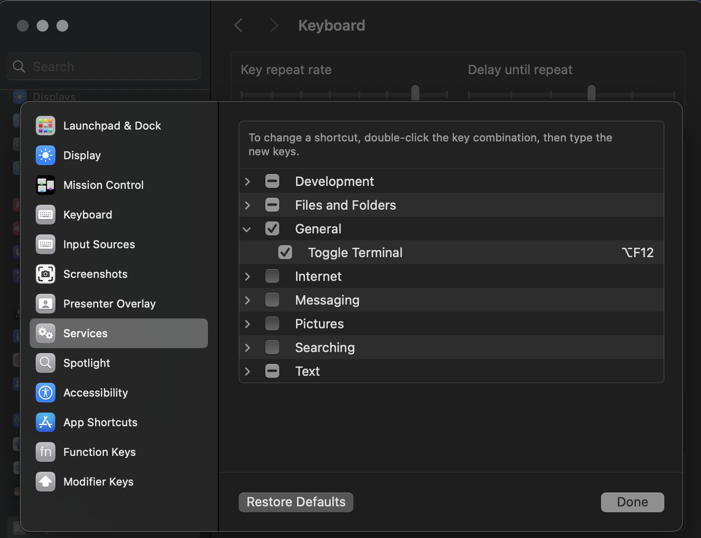

# WezTerm MacOS customisations

## Create MacOS script to toggle the app

```
-- Define needed vars
set appName to "WezTerm"
set launcher to "/Applications/WezTerm.app/Contents/MacOS/wezterm-gui"

-- Ensure System Events is activated to check frontmost process
tell application "System Events"
	set frontmostProcess to first process where it is frontmost
end tell

if application appName is not running then
	do shell script launcher
else
	-- Compare frontmost process name with appName
	if name of frontmostProcess is not appName then
		tell application appName
			activate
		end tell
	end if
end if
```

and then export it as signed `ToggleTerm.app`

## Define WezTerm shortcut to hide it when active

```lua
  	{
  		key = 'F12',
  		mods = 'OPT',
  		action = wezterm.action.HideApplication
  	}
```

## Create Automator Trigger


## Create Keyboard Shortcut


## Enjoy!

Now pressing `Option+F12` switches you to the terminal and back from everywhere.
